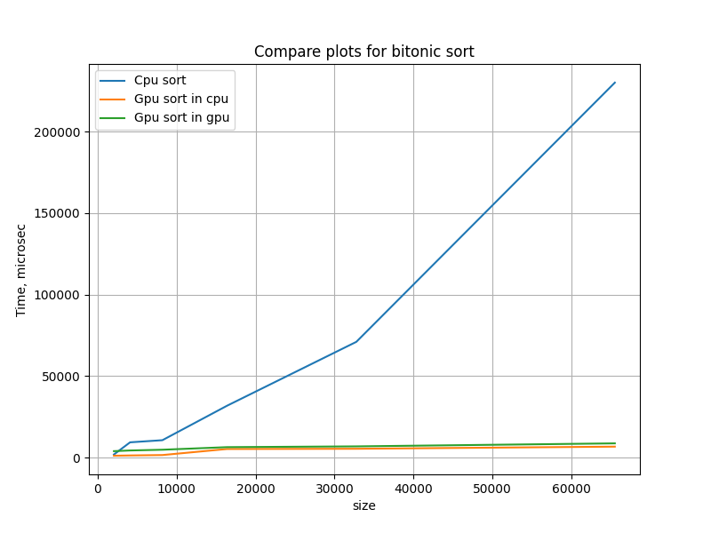

# OpenCL Bitonic Sort
This is my solution of 'Bitonic Sort' task.

## Build
To build program:
```
        git clone https://github.com/kefirRzevo/Vladimirov-CPP-course.git
        cd Vladimirov-CPP-course/OpenCL
        mkdir build
        cd build
        cmake ..
        cmake --build .
```

## Tree test
To generate tests:
```
        ./run.sh
```
To check my tests:
```
        ./bsort_test
```

## Comparison of time spent on Cpu and Gpu in GpuBitonicSort and CpuBitonicSort

You can see the results on this picture:



## Test Generator

There is script `test/TestGen.py` that can generate sort tests. You can configure tests in file `test/config.json`.
