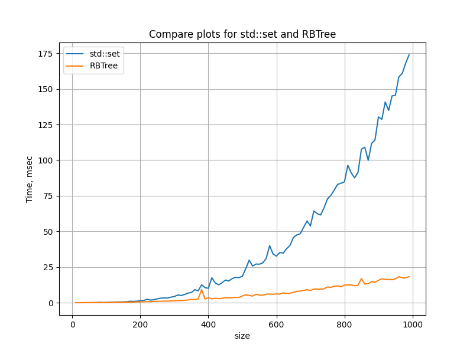

# Tree
This is my solution of 'Search Tree' task. On the input we have 3 types of commands.

+ `k` & `key` - add element to the tree by its key
+ `q` & `num1`, `num2` - search number of elements between num1 and num2
+ `e` - end

For example, 
```
        input: k 10 k 20 q 8 31 q 6 9 k 30 k 40 q 15 40 e
        output: 2 0 3 
```

## Build
To build program:
```
        git clone https://github.com/kefirRzevo/Vladimirov-CPP-course.git
        cd Vladimirov-CPP-course/Tree
        mkdir build
        cd build
        cmake ..
        cmake --build .
```

## Tree test
To check my tests:
```
        ./tree_test
```

## Std::set function `distance()` and my tree method `distance()` comparison

Function `std::distance( InputIt first, InputIt last )` and my method `distance(iterator first, iterator last)` were tested on trees with size from 10 to 1000. Here you can see results:



## Test Generator

There is script `test/TestGen.py` that can generate end2end tests. You can configure tests in file `test/config.json`.

## More comparison

You can run the task using my algorithm
```
        ./myDistance_test
```
And using std:
```
        ./stdDistance_test
```
To see which one is faster.